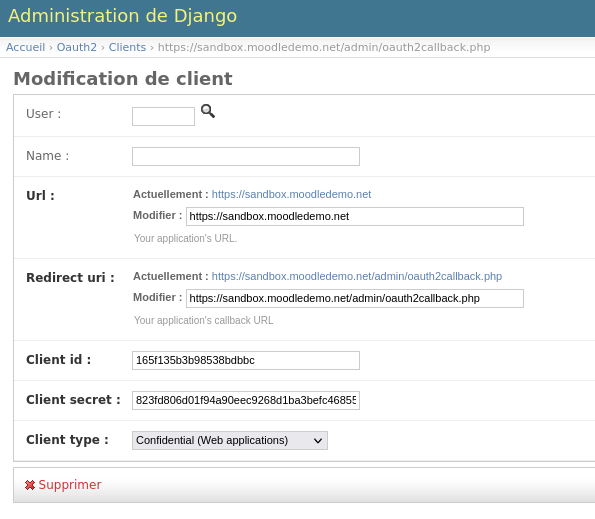
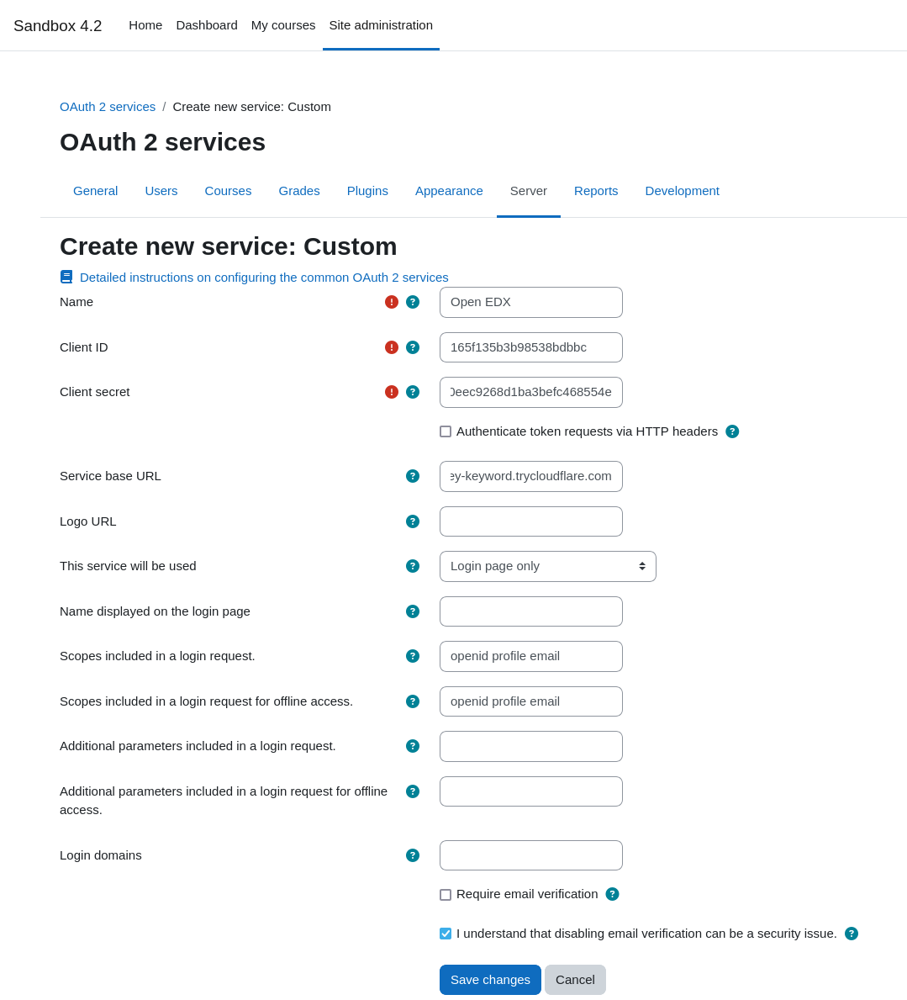
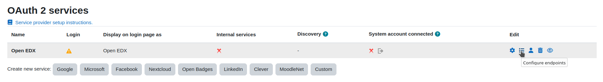
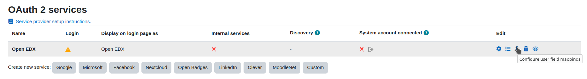
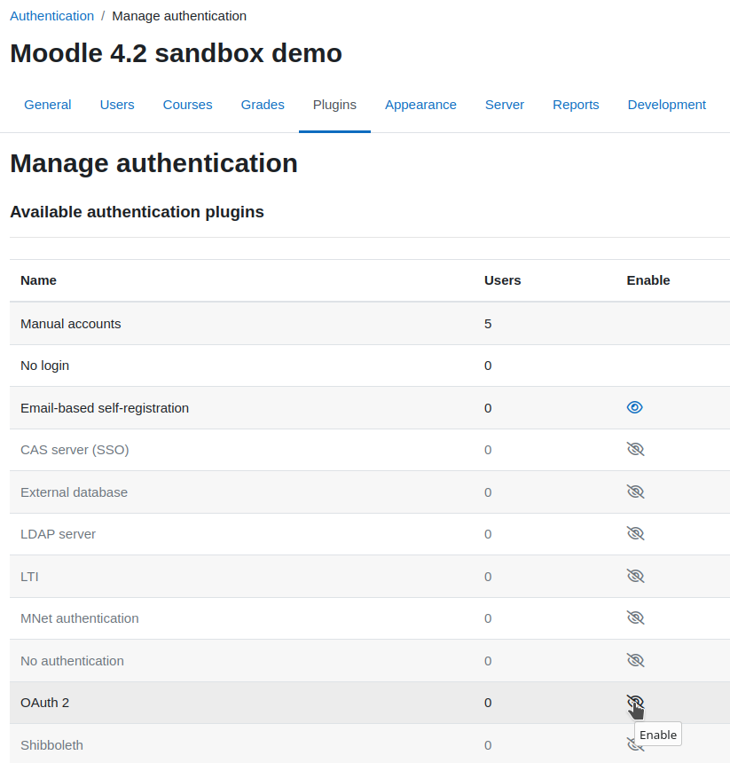

# Moodle OAuth Configuration

To integrate Moodle and Open edX, you can use OAuth to allow users to log in to Moodle using their Open edX credentials.
Follow these steps to configure Moodle OAuth with Open edX.

## Open edX Configuration

1. In the Open edX platform, go to the Django admin panel at `http://<your Open edX LMS URL>/admin`.
2. Go to http://localhost:8072/admin/oauth2/client/ and click **Add Client**.
3. Fill the **URI** field with the URL of your Moodle instance.

   `https://sandbox.moodledemo.net`
4. Fill the **Redirect uri** field with the callback URL of your Moodle instance.

   `https://sandbox.moodledemo.net/admin/oauth2callback.php`
5. Keep the generated client id and secret for later use.
6. Set the **client type** to `Confidential`.
7. Click **Save**.

## Moodle Configuration

[Detailed Moodle configuration documentation](https://docs.moodle.org/402/en/OAuth_2_services)

### Create a new OAuth2 custom service

1. In the Moodle admin panel, go to `Site administration > Server > OAuth 2 services`.
2. Click **Create a new custom service**.
3. Fill the **Name** field with a name of your choice.
4. Fill the **Client ID** and **Client secret** fields with the values generated in the Open edX configuration step.
5. Fill the **Service base URL** field with the URL of your Open edX instance.

   `http://<your Open edX LMS URL>`
6. Set the **This service will be used** field to `Login page only`.
7. Fill the **Name displayed on the login page** field with a name of your choice.
8. Uncheck the **Require email verification** field.
9. Check the **I understand that disabling email verification can be a security issue.** field.
10. Click **Save changes**.

### Configure endpoints

1. Click on the **Configure endpoints** button.

   
2. Click on **Create new endpoint for issuer "Open EDX"**.
3. Create the following endpoints:

   | Name                   | URL                                                   |
   |------------------------|-------------------------------------------------------|
   | authorization_endpoint | `http://<your Open edX LMS URL>/oauth2/authorize/`    |
   | token_endpoint         | `http://<your Open edX LMS URL>/oauth2/access_token/` |
   | userinfo_endpoint      | `http://<your Open edX LMS URL>/oauth2/user_info/`    |

### Configure user field mapping

1. Click on the **Configure user field mappings** button.

   
2. Create the following mappings:

   | External field name | Internal field name |
   |---------------------|---------------------|
   | email               | email               |
   | preferred_username  | username            |

### Activate OAuth2 login

1. In the Moodle admin panel, go to `Site administration > Plugins > Authentication > Manage authentication`.
2. Make sure that **Prevent account creation when authenticating** is unchecked.
3. Enable the **OAuth 2** plugin.

    

You can now log in to Moodle using your Open edX credentials.

